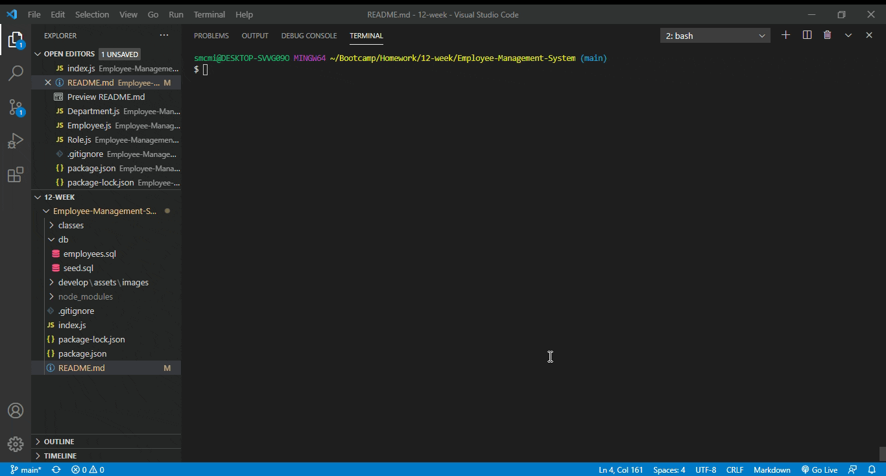

# Employee Management System

## Description of Project
This project is a back-end, Node.js command-line application that uses SQL to display and edit a company's employee information based on role and department.   

Usage instructions and video demo are below, but once initiated, you will have the option to view data and/or edit information in the database.  Depending on your choices, you will be prompted further to input information for the database to store.  

Read below for further details.  Enjoy!

## Table of Contents

- [Usage](#usage)
- [Credits and Code Used](#credits-and-code-used)
- [Application Demo](#application-demo)
- [Questions](#questions)
- [Takeaways and Future Development](#takeaways-and-future-development)

## Usage
To run the program, type the following command in your terminal:

```bash
node index.js
```

## Credits and Code Used

- JavaScript/ES6
- Node.js
- SQL
- npm inquirer and mysql packages

## Application Demo



## Questions
Check out my GitHub profile [here.](https://github.com/smcmillan28)

Feel free to send me an email, as well: smcmillan1991@gmail.com

## Takeaways and Future Development
This was my first introduction to SQL, so learning how to incorporate that into dynamic queries prompted by user input has stretched my comfort zone.  Below are next steps to expand on the application's functionality.  

- Adding the ability to edit employee role information in case of promotion
- Adding the ability to delete employees from database in the event of termination or resignation
- View departments by budget and set limits on number of roles/employees that can be hired/entered into the system